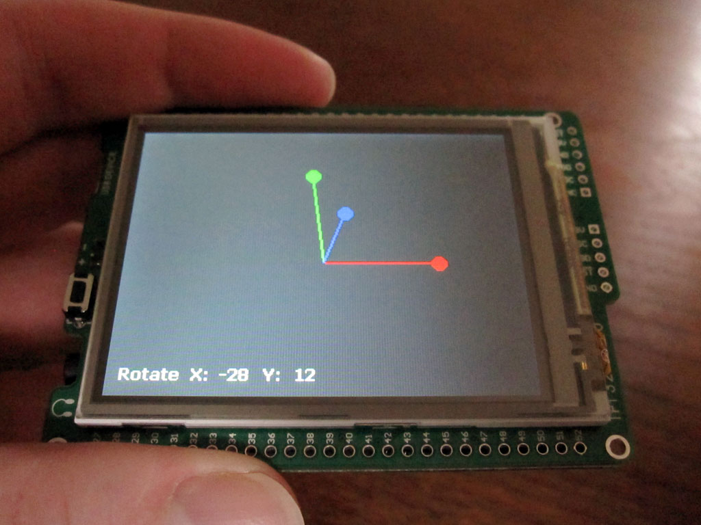

# mikroMMB PIC32 3D Accelerometer Demo #

**Dec 6, 2013 Version 1.1**
--------------------------------------------------

This firmware is a 3D demo for the accelerometer built into the mikromedia PIC32 board from MikroElektronika.

The numbers onscreen are the tilt in degrees.

The 3D axis view compass shows the orientation of the X, Y, and Z axes. The red line is the X axis, the green line is for the Y axis, and the blue line is the Z axis. 

Note: The blue (Z axis) always tries to point upright.

This demo has been updated for use with MikroC Pro for PIC32 3.3

Created by Andrew Hazelden. (c) copyright 2012-2013.

e-mail: [andrew@andrewhazelden.com](mailto:andrew@andrewhazelden.com)

Blog: [http://www.andrewhazelden.com](http://www.andrewhazelden.com)

------------------------------------------------------

# Installation #

**Install Firmware:** Flash the firmware file mini3d.hex to your mikromedia PIC32 board.

------------------------------------------------------

**Hardware Required:**

`MikroMMB_for_PIC32_hw_rev_1.10 `  
[http://www.mikroe.com/mikromedia/pic32/](http://www.mikroe.com/mikromedia/pic32/)

**MCU:** P32MX460F512L
 
**Oscillator:** 80000000 Hz

**Accelerometer:** ADXL345

------------------------------------------------------

**Accelerometer Imagery**

YouTube Video: [http://www.youtube.com/watch?v=UpHEq9thxYE](http://www.youtube.com/watch?v=UpHEq9thxYE)

